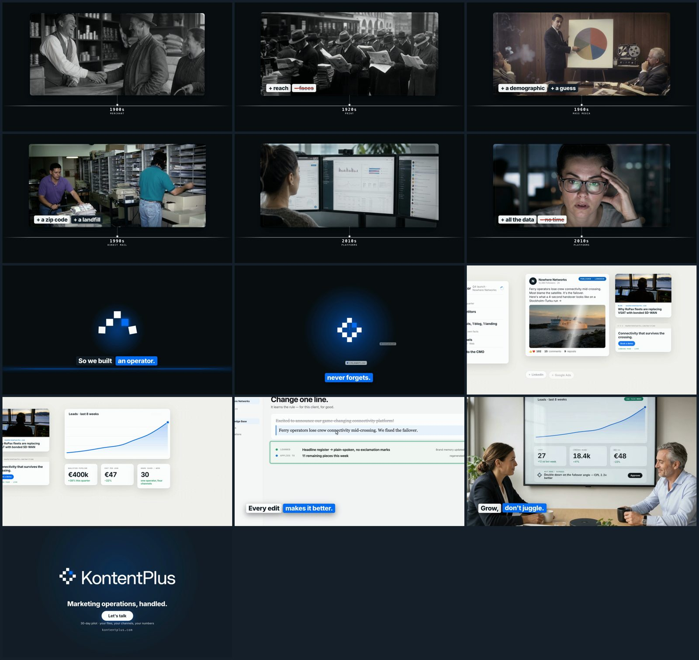
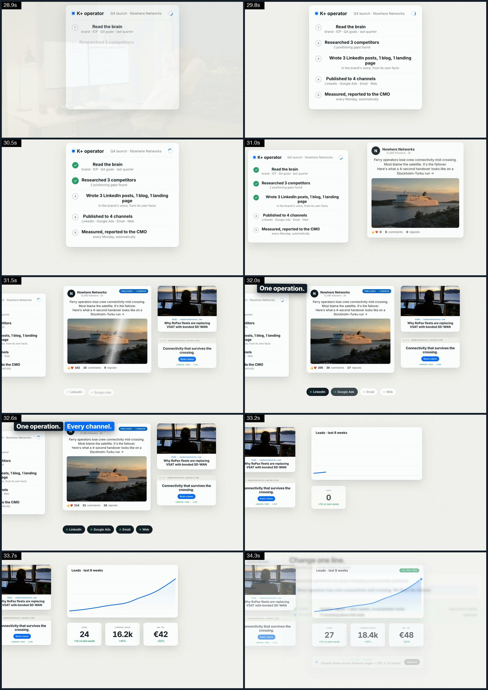
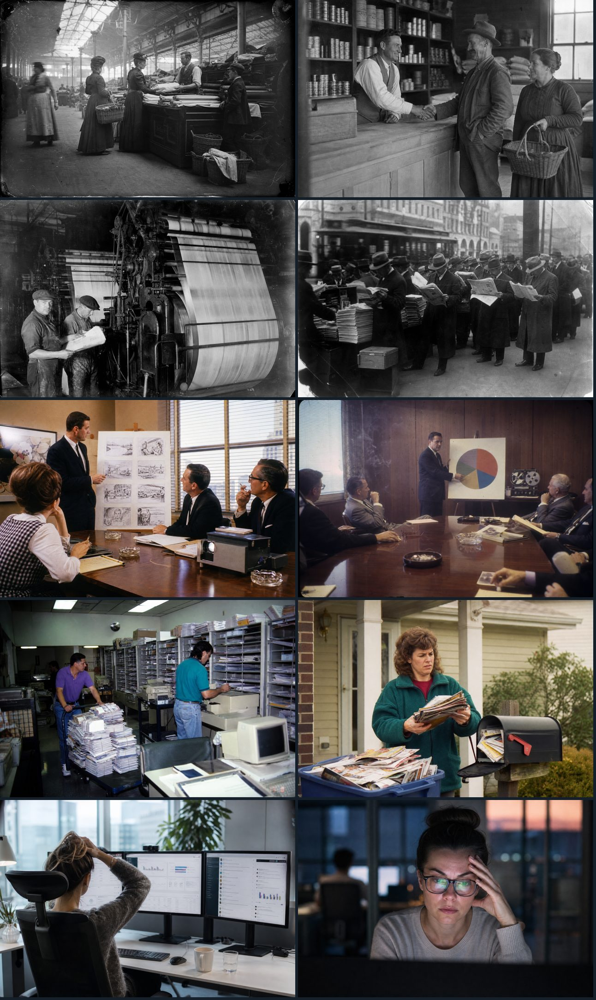
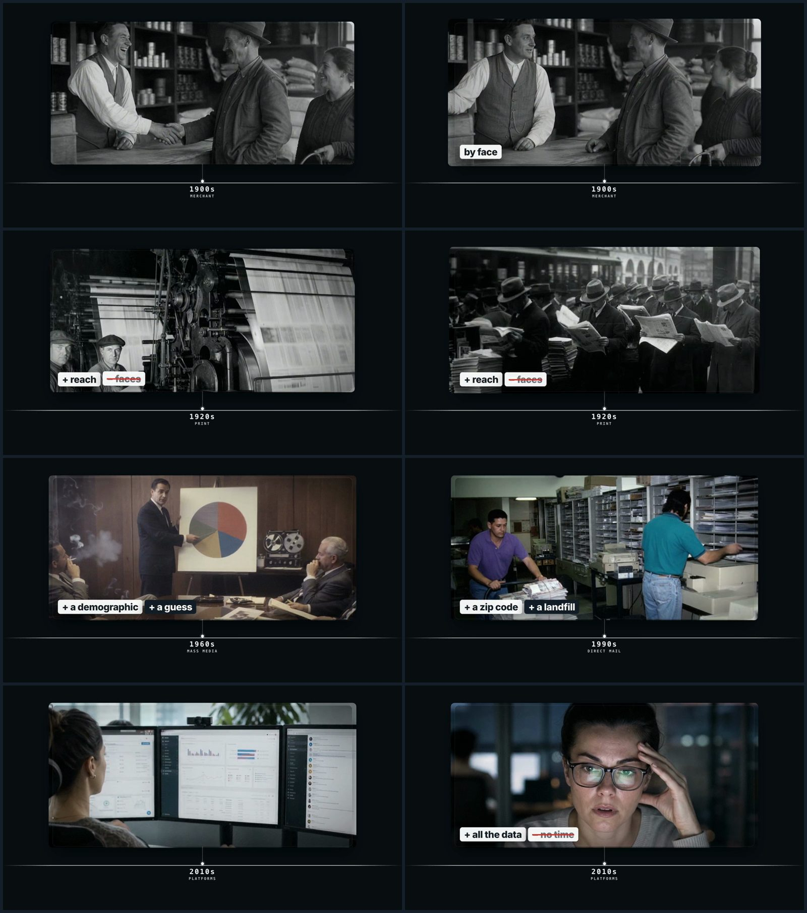

# Example: "Knowing the customer" — KontentPlus launch film (50 s, 16:9 + 9:16)

A complete run of the pipeline for a B2B product launch film: marketing through the eras on a **timeline device**,
a turn ("So we built an operator"), then the product as a **native motion-graphics canvas**, a results scene and an
end card. Built in one evening (4–5 Sep 2026) with the scripts in this skill. Everything here is real project code; only
the media (clips, audio, stills) is left out for size and licensing.

| | |
|---|---|
| Runtime | 49.7 s · 24 fps · 1920×1080 master + 1080×1920 LinkedIn cut from the same build |
| Narration | ElevenLabs "Chris", founder voice, 12 lines (`docs/vo_options.md`, option B) |
| Footage | 6 era plates + 1 results scene: GPT Image 2 archival stills → Omni image-to-video 720p → Omni upscale 1080p |
| Graphics | HyperFrames 0.8.27: timeline module + axis + pushes, kinetic cards, pixel logo build, brain beat, operator canvas, animated end card |
| Cost | ≈ $65–75 in API spend (`cost_report.py`), two footage rounds included |
| Quality gate | blind Gemini jury 6–7/10; anchored jury stuck at 7 for six rounds (see `refs/`) |



## Story (docs/)

- `script_eras.md` — scene-by-scene narrative: decades not years, marketplace → print → agencies → direct mail →
  platforms → "so we built an operator" → brain → one operation, every channel → it compounds → results → end card.
- `treatment_timeline.md` — Gemini's read of the previous cut and the timeline device that fixed it (one frame, one motion).
- `vo_options.md` — three narration options; the client picked B.
- `footage_plan.html` — the real-footage plan (archival + shoot) with the route-change banner once the client chose
  generated footage instead. Slot timings and swap-in still apply.

## Build (film/)

```
make_spec.py    VO lines scheduled sequentially (gap 0.25 s); scenes sized so each anchored scene starts at line.start − offset;
                era offsets −0.05 s so pushes land on the line; clamps to source length; end card ≥ 7.5 s.
                ASPECT=9:16 OUT_DIR=../film_916 switches width/height and output dir.
align_music.py  builds the music "hard stop" the generator ignores: trim at the turn + silence + sub pulse + looped calm section.
overlays.py     everything injected on top of the builder's index.html — the timeline device (module mask, axis, ticks, pushes,
                bloom), kinetic cards timed from VO, pixel logo build, UI plates with measured rings + cursor, the brain beat,
                the operator canvas (log → real post → chips → chart/counters → approved proposal, camera keyed to words),
                the shot-match grade (§6b — canonical `data-color-grading` on every live-action clip), animated end-card lockup.
                All geometry from FW/FH so the same file builds 9:16.
scenes.json / timing.json   the generated spec and the timing table (scene starts, VO line starts) for the 16:9 master.
```

Chain (run from the project's `film/` dir after `source ~/config.env`):

```bash
MUSIC=bgmusic_jazz.mp3 python3 make_spec.py \
 && CALM_FROM=30 CALM_TO=68 MUSIC_SRC=bgmusic_jazz.mp3 MUSIC_OUT=bgmusic_jazz_aligned.mp3 python3 align_music.py <turn> <total> \
 && python3 make_spec.py \
 && python3 ~/.claude/skills/ai-film-studio/scripts/build_hyperframes_timeline.py --project . --spec scenes.json \
 && python3 overlays.py && npx hyperframes@0.8.27 check --no-contrast \
 && ~/.claude/skills/ai-film-studio/scripts/master.sh render . renders/final.mp4
# vertical: prefix the three python calls with ASPECT=9:16 OUT_DIR=../film_916 and point the builder at ../film_916
```

## Grading — the bug that shipped, and the fix

The first delivery went out with the meeting-room plate **ungraded** while every era plate was graded — the client's
note was "the woman at the screen and the meeting room aren't the same movie". Cause: `overlays.py` wrote the plate's
grade as `#scene-12 video { filter: … }`, but `scene-12` *is* the `<video>`, so the descendant selector matched nothing
and silently did nothing. The era plates were fine because their grade rode on `.era-mod`, a class on the video itself.

Measured with `hyperframes media-treatment --analyze` (p1 / mean / p99 luma) the plate sat at 52.8 / 159.5 / 212.8
against a film living at 25–36 / 61–107 / 120–190: a milky black floor and ~50 IRE hot. Each clip alone is "clean", so
per-clip analysis suggests nothing — the fault is *relative*, which is why you shot-match.

What §6b in `overlays.py` does now, and what to copy:

1. **No handmade CSS `filter` colour rules on media.** They bypass HyperFrames' shader path (see `/media-use`), can't be
   inspected in Studio, and — as above — fail silently. Colour lives in `data-color-grading` stamped on the `<video>`.
2. **One shared print + a per-shot match.** Wheels (cool shadows / warm highlights) and one master S-curve on every
   live-action clip; then per-clip `adjust` onto a common black floor (~26–30) and highlight ceiling (~180–200).
   Archival mono gets the tonal match only — no wheels, or it reads as sepia.
3. **No vignette or grain in the payload.** The first graded pass had both; the client's reply was "you added a black
   filter, the edges are easily visible." The era modules already carry an edge treatment (`.mod-grain`, sized to the
   module), and in the 9:16 build the `<video>` *is* the module rect, so a shader vignette lands its full darkening at
   the clip edge (corners/centre 0.68 → 0.62). Removed; the results plate then needed exposure −0.50 instead of −0.40,
   because the vignette had been taking ~10 IRE off its edges. (If you ever add them: the key is `details`, not
   `finishing`, or `check` fails with `color_grading_invalid_structure`.)
4. **The old CSS filters also carried the film's desaturation** (`saturate(.88)` eras, `saturate(.8)` modern). Removing
   them without folding that back in as `saturation: -0.12` / `-0.20` in the payload makes the whole film more saturated
   than the cut the client approved. Measure before and after; don't trust the eye on a contact sheet for this.
5. Verify on the *rendered* file, not only snapshots: pull the same timestamps from the old and new master and compare
   p1 / mean / p99 per shot — and the module edge/centre ratio, which is how the vignette was caught. Result here:
   meeting room 168.6 → ~129 mean, black floor 8.4 → ~5; every era module's edge ratio back within 0.01 of the approved cut.

## Product canvas (the part that took three tries)



Round 1: v9 mockup screenshots with highlight rings — rejected ("selection highlight is off"). Round 2: purpose-built
hero screens (`hero/`) with rings — rejected ("make it more visual, real image of the post, show how it's working").
Round 3, kept: a title scene filled by `overlays.py` with a 3300 px world and a camera that pans on the words
"strategy / content / every channel / what actually worked". Lessons are in SKILL.md → *Product sections*.

`hero/hero1.html` and `hero/hero4.html` are still used as the files screen and the edit screen; their rings and cursor
targets were **measured** with `measure_ui.py` after guessed coordinates missed three times.

## Era footage (eras/)




Two rounds. Round 1 (Seedance 2.5 with style frames, hands only, no faces) read as stock. Round 2: GPT Image 2
*archival photographs* with real people and faces (glass plate, silver gelatin, Kodachrome, 35 mm + flash, camcorder),
animated with Omni with era artefacts in the prompt. `pick_project.py` is the Gemini picker as used here
(generalised as `scripts/pick_takes.py`); `swap_in.sh` conforms and installs takes by slot name. Findings that became
skill rules: natural continuous motion beats "hold still"; Omni pops phantom figures after ~4 s; join two takes for a
long slot; slow a 6 s take with `setpts=1.18` to cover 7 s; `--upscale` via the original interaction works from the EEA.

## Quality gate (refs/)

- `timeline_v3_jury.json` → 7/10; `timeline_v9_jury.json` → still 7 after six rounds of "improved"; `timeline_v9_path_to_9.json`
  is the per-dimension ask; `blind_jury_v13.json` → 6–6.5 with no history. The evaluator's ceiling for generated plates is
  ~7; its last notes were structural (live-action ending after the UI, tone at the turn). The client approved v14.
- `picks_round1.json` — the take scores with artefact timestamps.

## What to copy for your own film

1. The VO-driven scheduler in `make_spec.py` (lines → anchored scenes).
2. The timeline device and the injection pattern in `overlays.py` (title scene as a canvas; `FW/FH` everywhere).
3. The era recipe and picker.
4. Blind jury twice, stop when the notes turn structural.
5. `master.sh` for finals; `ASPECT=9:16` for the vertical.
6. The §6b shot-match grade block — and the check that every `data-color-grading` target actually matched.
